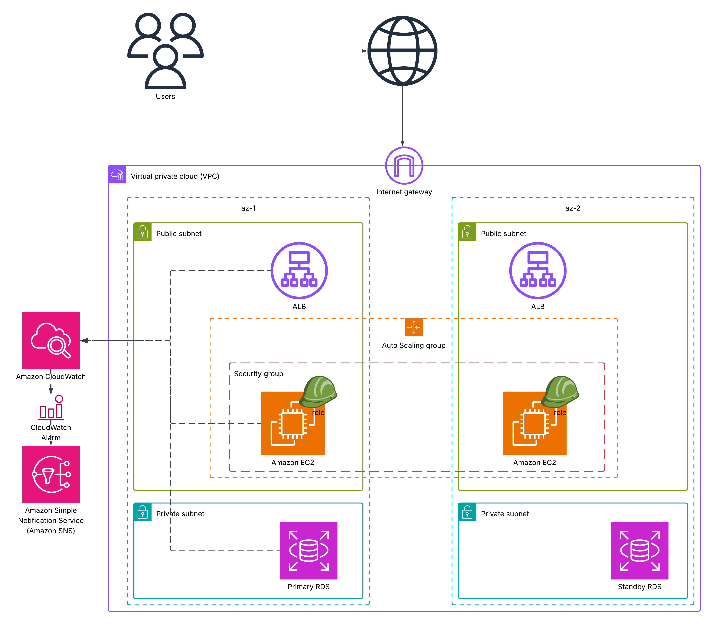

# Scalable Web Application Infrastructure on AWS

## Table of Contents

1. [Solution Overview](#solution-overview)
2. [Architecture Diagram](#architecture-diagram)
3. [Components Description](#components-description)
4. [Networking and Security](#networking-and-security)
5. [Monitoring and Alerts](#monitoring-and-alerts)
6. [High Availability and Scalability](#high-availability-and-scalability)
7. [Future Improvements](#future-improvements)

---

## Solution Overview

This project outlines the design and layout of a scalable and highly available web application infrastructure hosted on Amazon Web Services (AWS). The goal is to ensure fault tolerance, easy scalability, and operational efficiency with automated monitoring and alerting. The infrastructure is ideal for modern cloud-native applications that require high availability and consistent performance.

The solution includes:

* Application servers hosted on EC2 instances.
* Load balancing using ALB to distribute traffic across AZs.
* Auto Scaling Group (ASG) for automated horizontal scaling.
* Amazon RDS for relational database services with high availability using Multi-AZ.
* Monitoring using Amazon CloudWatch.
* Notifications using Amazon Simple Notification Service (SNS).

Key design principles:

* **Resiliency**: Handles failure of a single component without service disruption.
* **Scalability**: Automatically adjusts to traffic demands.
* **Security**: Network isolation and tightly controlled access.
* **Operational Efficiency**: Automated monitoring, alerting, and self-healing.

---

## Architecture Diagram

The following diagram visually represents the architecture:

---

## Components Description

### Compute Layer

* **Amazon EC2**: Virtual machines that run your application. Deployed in two AZs for availability.
* **Launch Template / Launch Configuration**: Blueprint for EC2 instance creation.
* **Auto Scaling Group (ASG)**: Ensures a minimum number of instances are always running. Automatically adds/removes instances based on CPU usage or other metrics.
* **Application Load Balancer (ALB)**: Distributes incoming application traffic to the EC2 instances. Handles health checks and automatically stops routing to unhealthy instances.

### Database Layer

* **Amazon RDS (Multi-AZ deployment)**:

  * **Primary RDS**: Receives all database write operations.
  * **Standby RDS**: Replicated asynchronously in a different AZ and used for automatic failover.
  * RDS resides in private subnets and is only accessible from EC2 instances within the VPC.

### Monitoring and Notification

* **Amazon CloudWatch**: Collects logs, metrics, and sets alarms based on thresholds.
* **CloudWatch Alarms**: Alert when a metric breaches a defined threshold (e.g., CPU > 80%).
* **Amazon SNS**: Sends notifications to email/SMS subscribers when alarms trigger.

---

## Networking and Security

### Virtual Private Cloud (VPC)

* Provides network isolation and control.
* Split into two Availability Zones (az-1 and az-2).

### Subnets

* **Public Subnets**:

  * Contain ALBs and EC2 instances.
  * Associated with a route table connected to an Internet Gateway for internet access.
* **Private Subnets**:

  * Host the RDS instances.
  * Not directly accessible from the internet.

### Route Tables

* **Public Route Table**:

  * Routes `0.0.0.0/0` traffic to the Internet Gateway.
* **Private Route Table**:

  * Routes internal VPC traffic only.

### Security Groups

* **EC2 Security Group**:

  * Allows traffic from ALB on HTTP/HTTPS.
* **ALB Security Group**:

  * Allows inbound traffic from internet on HTTP/HTTPS.
* **RDS Security Group**:

  * Allows traffic only from EC2 security group on port 3306 (MySQL).

### Internet Gateway

* Provides internet access to instances in public subnets.

> **Note**: No NAT Gateway is included since the EC2 instances are placed in public subnets.

---

## Monitoring and Alerts

* **CloudWatch Metrics**:

  * CPUUtilization, NetworkIn/Out, StatusCheckFailed for EC2
  * CPUUtilization, DatabaseConnections, FreeStorageSpace for RDS

* **CloudWatch Alarms**:

  * Triggered when CPU > 80%, status check fails, or DB storage is low.

* **SNS Topics**:

  * Sends alerts to Ops team via email or SMS.
  * Can trigger Lambda or other automation workflows.

---

## High Availability and Scalability

* **Availability Zones**:

  * Redundancy by deploying resources in multiple AZs (az-1 and az-2).

* **Auto Scaling Group**:

  * Dynamically increases or decreases EC2 count based on metrics.

* **RDS Multi-AZ**:

  * Standby instance allows automatic failover in case of AZ failure.

* **ALB**:

  * Performs health checks and redirects traffic away from unhealthy targets.

---

## Future Improvements

* **Infrastructure as Code (IaC)**:

  * Use Terraform, AWS CDK, or CloudFormation to automate deployments.

* **Security Enhancements**:

  * Add AWS WAF for application-level protection.
  * Integrate with AWS Shield for DDoS protection.

* **Logging and Auditing**:

  * Enable AWS CloudTrail for API auditing.
  * Centralized logging using CloudWatch Logs Insights or ELK Stack.

* **Cost Optimization**:

  * Implement EC2 Spot Instances or Savings Plans.
  * Use Trusted Advisor recommendations.

* **CI/CD Pipeline**:

  * Integrate CodePipeline, CodeDeploy, and CodeBuild for automation.

* **Backup and Recovery**:

  * Enable RDS automated backups and snapshots.
  * Test disaster recovery procedures regularly.

